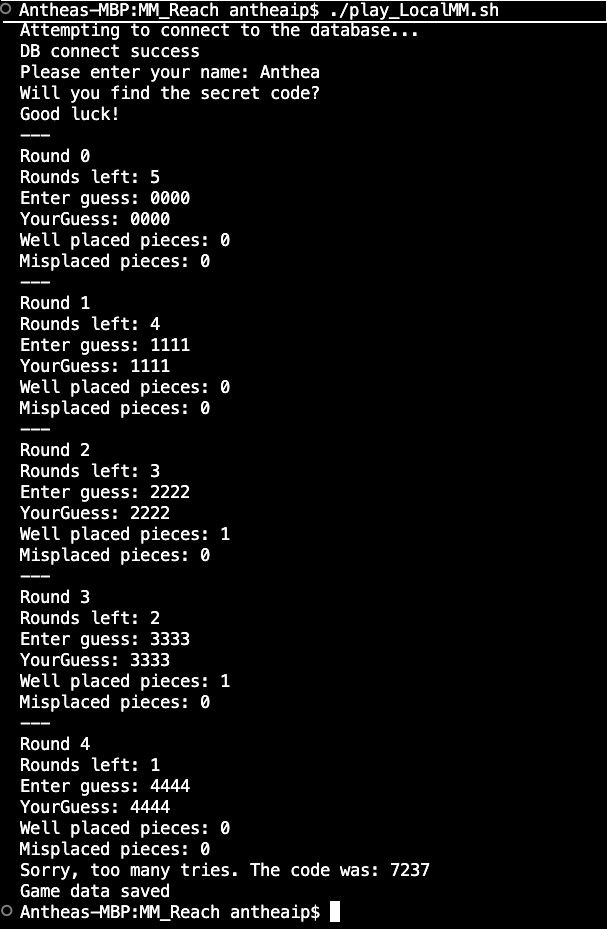
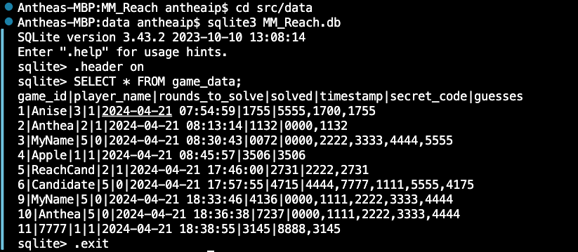
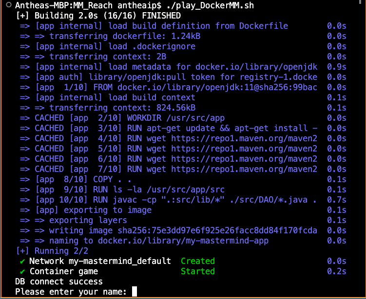
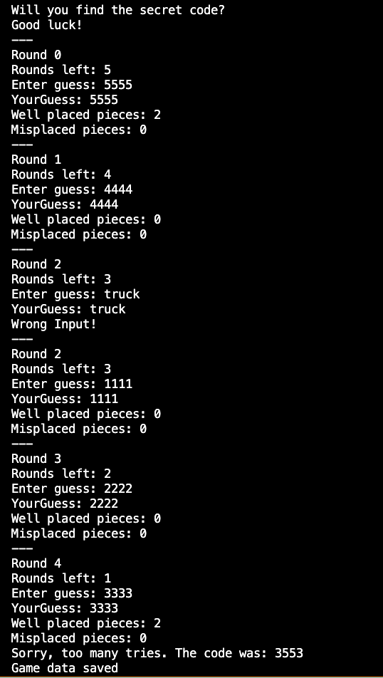

# Welcome to My Mastermind in Java
## Task
This project implementats the classic Mastermind number guessing game. The user plays against the program. Read more about it here: 
* https://en.wikipedia.org/wiki/Mastermind_(board_game)

It's written in Java with Object Oriented Programming and (mostly) SOLID design. Game data (player name, number of rounds, solved, timestamp, secret code, and guess history) will save to an SQLite database. It's also Docker-enabled, so the user can play in the container.

## Game Rules
The Mastermind game requires the user to guess the secret code composed of four distinct pieces. After each guess, the user will be informed of the number of correctly placed pieces and the number of misplaced pieces. The objective is to guess the secret code in the fewest attempts possible. There are 8 pieces (numbers 0 -7), and a secret code composed of 4 distinct pieces.

Typically, the user has 10 tries to guess the right pieces and sequence. After each guess, the user will be told the number of correctly placed pieces, and misplaced pieces. (For brevity, my screen captures have a 10-try maximum.)

* Once the game starts, database connection messages will display
* Once the game ends, a game save message should display
* Refer to the screen captures
* Once the game starts, the user will be prompted to enter a name
* The user will be told which round (starting at 0), and remaining rounds
* Each guess must be 4 digits 0 - 7. There will be 10 chances to guess the code.

## Installation and Operation
The game can be played through a command line interface (locally), or through a Docker container (requires Docker Desktop). The addition of Docker should allow a user to run my application on any system that supports Docker.

Copy the repository:
* git clone https://github.com/aip956/MM_Reach.git

Change into the cloned repository
* cd MM_Reach
 

### To run locally: 
Open the terminal and navigate to the game's directory. In the command line, 
1. Compile:  
    * javac -cp "src:src/lib/*" src/DAO/*.java src/DBConnectionManager/*.java src/Models/*.java src/View/*.java src/MyMastermind.java 
2. Run:  
    * java -cp "src:src/lib/*" MyMastermind 
3. View data:
    * In the command line, change directory
        * cd src/data
    * Open the SQL shell
        * sqlite3 MM_Reach.db
    * Optional: Turn on headers
        * .header on
    * View the data
        * SELECT * FROM game_data;
    * Exit the sql shell
        * .exit

### To build and run in the Docker container:
1. Start the Desktop Docker
2. In the game directory's command line, compile and run:
    * ./play_mastermind
3. Check data:
    * .Start game again, but don't play:
      * ./play_mastermind
    * Open another terminal and enter container bash shell:
      * docker exec -it game /bin/bash
    * Change directory to the data dir
      * cd src/data
    * Open the sql shell, MM_Reach database
      * sqlite3 MM_Reach.db
    * Turn header view on
      * .header on
    * View the data
      * SELECT * FROM game_data;
    * Exit the sql shell
      * .exit
    * Exit the container's bash shell
      * exit
 
 
## Screen Captures
For the sake of brevity, I limited the maximum attempts to 5 (instead of 10).
 
 

#### Run and play the game locally using the command line:  

 

#### Wrong input entered!  
 
 

#### Viewing data in DB Browser:  

 

#### Viewing data in the terminal  

 
 

### Running in Docker:
#### Build and Run Container:  

 

#### Playing in Docker:  

 

#### View Docker Data:  

 

#### Docker Desktop, Container:  

 

#### Docker Desktop, Image:  

 

 

## Design
I created this in Java, using Object Oriented Programming and SOLID Principles. Creating the class structure is challenging for me, and I thought about the nouns I was modelling. It's a game, with two players. I therefore created the following classes:

MyMastermind: Contains the main class; creates a new instance of the Game and starts the game by invoking the startGame method.

#### Models Package
Game: This class manages the game flow, including starting the game, managing the rounds, and finalizing the game data. 
* Single Responsibility: Coordinates game logic
* Dependency Inversion Principle: Relies on abstractions by interacting with the Guesser, SecretKeeper, GameData, and GameDataDAO interfaces rather than concrete implementations

Player: The Player is an abstract class for players. SecretKeeper and Guesser will extend from Player.  
* Open/Closed Principle: It's easily extendable to add more player types without modifying existing code.
* Abstraction: It abstracts player details, providing a base for specific player types.

SecretKeeper: The SecretKeeper generates and maintains the secret code, evaluates guesses, and provides feedback. It extends from Player. 
* Single Responsibility Principle: Focused on maintaining and validating the secret code.
* Dependency Inversion Principle: It uses Player as a base class, promoting use of abstractions over concrete classes.

Guesser: The Guesser represents the player making guesses against the secret code. It extends from Player; it inputs the guess.
* Open/Closed Principle: New guessing strategies can be added without modifying existing code by extending this class.
* Liskov Substitution Principle: As a subclass of Player, it can be used anywhere a Player is expected without affecting the behavior negatively.

GameData: The GameData stores the relevant data about a game session, such as player name, guesses, and outcome.
* Single Responsibility Principle: It's solely responsible for holding and transferring game data.
* Encapsulation: It keeps data safe from unauthorized access, exposing only necessary parts through methods

#### View Package
GameUI: The GameUI handles all user interactions, including displaying messages and capturing user input.
* Single Responsibility Principle: It's dedicated solely to user interface operations.

#### DAO Package
GameDataDAO: This class is an interface for data access operations related to GameData, such as saving and retrieving game data. (Other game retrieval methods would be defined here, like getGamesByPlayer)
* Interface Segregation Principle: Clients will not be forced to depend on methods they do not use.

SQLiteGameDataDAO: This class implements GameDataDAO, providing specific data operations using SQLite. (Other games retrieval methods would be implemented here.)
* Dependency Inversion Principle: It depends on the GameDataDAO abstraction, allowing for flexibility in data storage methods
* Single Responsibility Principle: It manages the database operations specific to GameData

#### DBConnectionManagerPackage
DatabaseConnectionManager: This class manages database connections, ensuring a single active connection or creating a new one as needed
* Single Responsiblity Principle: It centralizes the management of database connections, separating it from other database operations
* Singleton Pattern: It ensures that there is a single instance of the connection, reused throughout the application

#### SOLID Design Principles:
While my game design aims to be SOLID, I also needed to balance simplicity and scope. For example, 

Single Responsibility Principle
* A class should have only one job/responsibility
* However, some of my classes take on additional responsibilities to avoid excessive fragmentation and over-complication.
* Game handles the game loop, processing guesses, interfacing with GameUI; it mixes game logic with user interaction. 

Open-Closed Principle
* Entities (classes, functions, etc.) should be open for extension but closed for modification
* However, some of my classes also are not closed to modification; this is also for simplicity.
* Adding new players might change how the Game class operates.

Liskov Sustitution Principle
* Objects of a superclass should be replaceable with objects of subclasses
* However, subclasses of Player (e.g. AIPlayer) might not be used interchangeably without the Game class knowing the differences.

Interface Segregation Principle
* Clients should not be forced to depend on interfaces they don't use
* However, some interfaces implementations do not use all methods

Dependency Inversion Principle
* High-level modules should not depend on low-level modules; both should depend on abstractions
* However, a high-level module (Game) might depend on low-level ones (e.g. Guesser, SQLiteGameDataDAO) rather than abstractions

#### OOP Principles:
Abstraction
* Hide implementation details

Inheritance
* Allows one object to acquire the properties and methods of another

Polymorphism
* Allows an inherited object to have different method implementations

Encapsulation
* Each object should control its own state

#### Other:
Java:
* I've been learning Java and felt it a good language for this project. It's a mature language, with vast ecosystem (development tools, libraries, community, etc.). I also chose an OOP design as the modularity allows greater complexity management and code reusability.

Docker:
* I've added Dockerfile to allow a user to run my application on any system that supports Docker.

Database
* I chose SQLite for the database. I assumed the data volume would be low, and the data is fairly structured.

Logging
* Included in the game code is Logback. While I was coding it was helpful for debugging. I've kept it in the code so that if the code is extended, logging can continue to help debug.

I've also added a .gitignore file to prevent certain files from being committed to the git repository. This will help keep the repository clean and focused.

## Future improvements
* Research other databases: I could use Mockito to generate data and test more robust databases (e.g. Postgres, MySQL, etc.)
* Add an AI Player: I'd create a new AIPlayer class that extends Player. The core of the AIPlayer will be a method that generates the guesses. I'd then modify the Game class
* JUnit tesing: Write and execute automated tests for models, game logic, DAO implementations, integration.
* Implement getGamesBy____ (Player, solved, etc.). This could be used for showing player and solve rate statistics. 